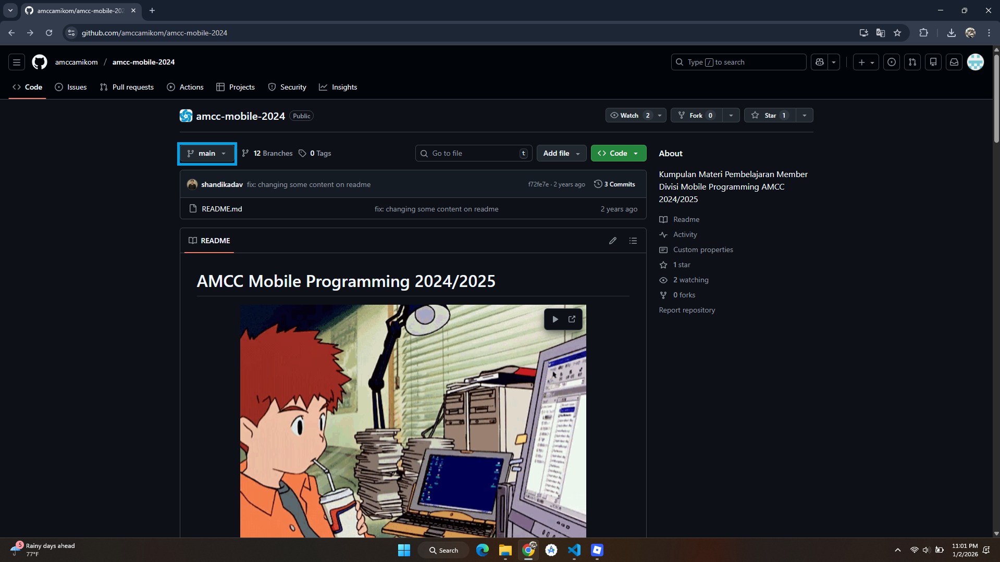
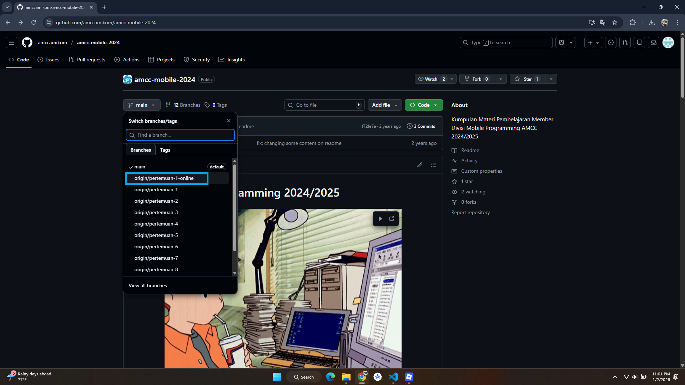
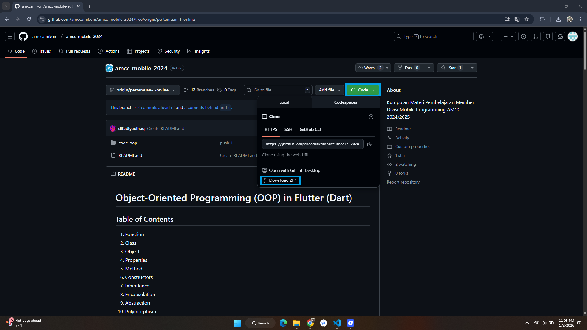
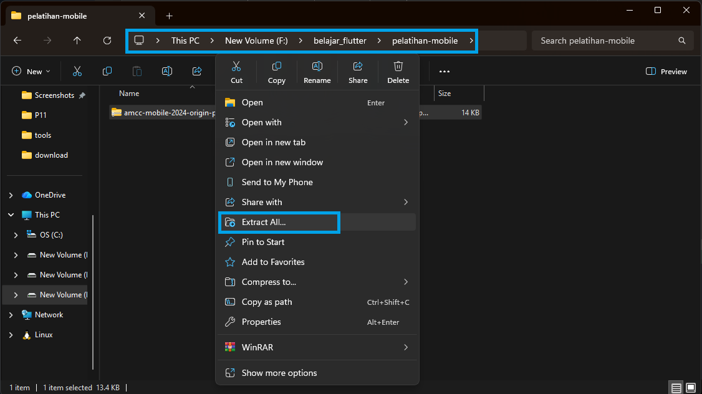
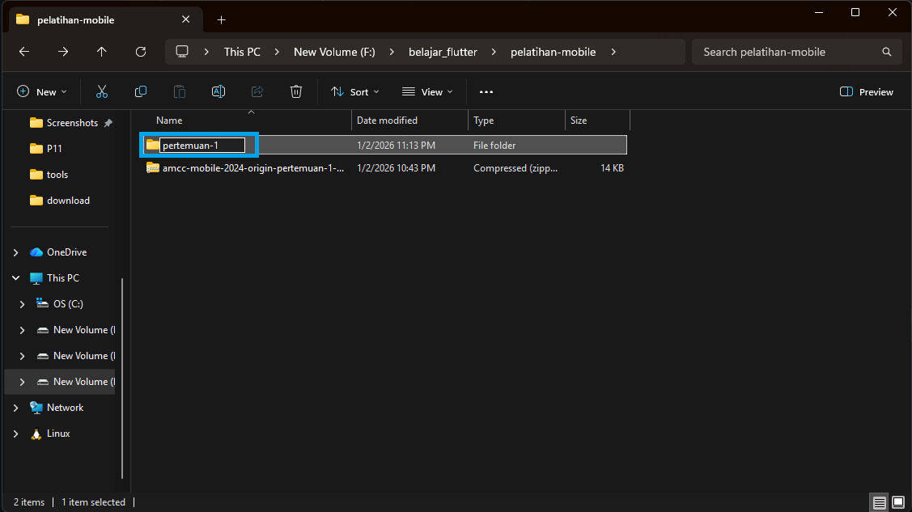
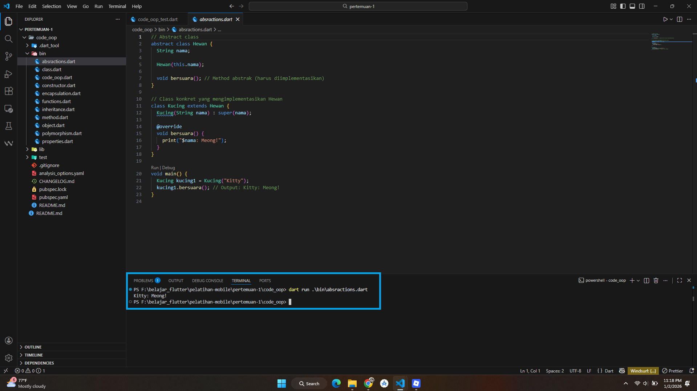

# Materi Mobile Programming 2025

Selamat datang di Repository Github **Materi Mobile Programming 2025**. Repository ini dirancang untuk membantu teman-teman untuk mengejar materi yang tertinggal atau meninjau ulang materi dari pertemuan sebelumnya. Semua materi yang ada disusun berdasarkan pertemuan untuk memudahkan dalam pencarian.

  <picture>
    <source media="(prefers-color-scheme: dark)" srcset="https://tenor.com/id/view/the-chase-studio-choom-choom-sm-sm-entertainment-gif-16889503316599328019">
    
  </picture>

## 📚 Tentang Mobile Programming

**Mobile programming** adalah seni menciptakan aplikasi yang dapat berjalan di perangkat seperti **smartphone** dan **tablet**. Ibarat membuat "kue aplikasi" untuk ponsel, kamu memerlukan resep (desain dan logika), bahan (kode dan elemen UI), serta alat yang tepat untuk menghasilkan aplikasi yang enak dipakai, mudah digunakan, dan sesuai dengan kebutuhan pengguna.

Di AMCC 2025/2026, mobile programming menjadi salah satu fokus pengembangan keahlian dengan **Flutter** sebagai **"alat tempur"** utama. Flutter, framework buatan Google, memungkinkan pengembangan **aplikasi lintas platform dengan satu basis kode**, memberikan efisiensi dan kemudahan dalam membuat aplikasi yang konsisten di Android maupun iOS.

> **Catatan**: Pilih branch sesuai dengan pertemuan yang teman-teman butuhkan sebelum mengunduh materi.

## Hal yang akan dipelajari

   

## 📋 Daftar Isi 
-   [🛠️ Instalasi Tools](https://medium.com/amcc-amikom/kenalan-bareng-tech-stack-mobile-programming-6671777d7d18)
-   [📚 Cara Mengunduh Materi](#-cara-mengunduh-materi)
-   [🚀 Cara Menjalankan File](#-cara-menjalankan-file)
-   [🗂️ Daftar Materi Berdasarkan Pertemuan](#%EF%B8%8F-daftar-materi-berdasarkan-pertemuan)

## 📚 Cara Mengunduh Materi

Ikuti langkah-langkah berikut untuk mengunduh materi : 

#### 1. Memilih Branch yang sesuai

-   Klik menu **"Branch"** di halaman utama repository.
-   Pilih branch yang sesuai dengan pertemuan yang dibutuhkan (contoh: `pertemuan-1`, `pertemuan-2`, dst).

#### 2. Cari Folder Materi

Navigasikan ke folder atau file yang sesuai dengan materi yang ingin diunduh.

#### 3. Unduh File ZIP

-   Klik tombol **"Code"** di kanan atas repository.
-   Pilih opsi **"Download ZIP"**.

#### 4. Ekstrak File ZIP

Setelah unduhan selesai, ekstrak file ZIP di komputer teman-teman untuk mengakses semua file materi.

## 🚀 Cara Menjalankan File

Setelah mengunduh dan mengekstrak materi dari repository, ikuti langkah-langkah berikut untuk menjalankan file di sistem lokal menggunakan **Laragon**:

#### 1. Ekstrak File ZIP ke Folder Pelatihan

-   Setelah file ZIP berhasil diunduh, ekstrak file tersebut.
-   Tempatkan hasil ekstrak di dalam folder pelatihan mobile teman-teman.
-   Contoh lokasi folder:
    -   **Windows**: `F:\belajar_flutter\pelatihan-mobile\`
    -   **Linux/Mac**: (sesuaikan lokasi folder pelatihan teman-teman).

#### 2. Ubah Nama Folder Hasil Ekstrak

-   Untuk mempermudah akses di Visual Studio Code, ubah nama folder hasil ekstrak.
-   **Contoh**:
    -   Dari: `amcc-mobile-2024-origin-pertemuan-1-online`
    -   Menjadi: `pertemuan-1`

#### 3. Jalankan Projek Aplikasi
-   Buka folder projek di Visual Studio Code
-   Untuk menjalankan aplikasi, teman-teman bisa menggunakan perintah `dart run nama_file` atau `flutter run`.

#### 4. Baca Dokumentasi di File `README.md`

-   Setiap materi yang diunduh memiliki file `README.md`.
-   File ini berisi dokumentasi atau panduan singkat mengenai isi repository tersebut, termasuk tujuan materi dan struktur file.

## 🗂️ Daftar Materi Berdasarkan Pertemuan

## 🎉 Penutup
Semoga dengan repositori ini bisa mempermudah pembelajaran divisi **Mobile Programming AMCC 2025/2026**. **Tetap semangat** dan juga **Learning by Doing, Learning by Teaching!**